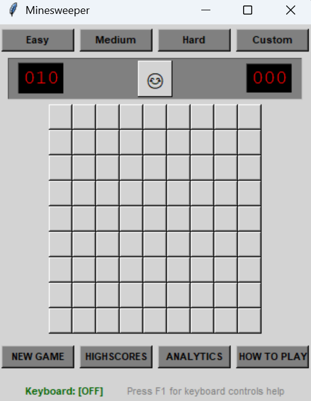

# 🧨 Minesweeper 

A modern, feature-rich implementation of the classic **Minesweeper** game built in **Python** using **Tkinter**.  
This project combines clean UI design, full keyboard support, analytics, and high-score tracking.

---

## 🎮 Features

### Core Gameplay
- Classic Minesweeper rules
- Left-click to reveal cells
- Right-click to flag mines
- Automatic reveal for empty cells
- Win & lose detection

### Difficulty Levels
- **Easy** — 9×9 grid, 10 mines  
- **Medium** — 16×16 grid, 40 mines  
- **Hard** — 16×30 grid, 99 mines  
- **Custom** — user-defined grid & mine count

### User Interface
- Modern clean UI theme
- Emoji-based reset button 😊 😎 😵
- Digital-style mine counter & timer
- Responsive layout with consistent styling
- Flat buttons & clear visual hierarchy

### Keyboard Controls
- Arrow keys → navigate board
- `Enter` / `Space` → reveal cell
- `F` → flag / unflag cell
- `Tab` → toggle keyboard navigation mode
- `N` / `R` → new game / reset
- `E`, `M`, `H`, `C` → switch difficulty
- `F1` → keyboard help dialog

### Extra Features
- ⏱️ Game timer
- 🏆 High-score tracking
- 📊 Game analytics with PDF report generation
- 💾 Persistent high scores
- 🧠 Keyboard navigation mode indicator

---

## 🛠️ Technologies Used

- Python 3
- Tkinter (GUI)
- Object-Oriented Programming
- Modular architecture

---

## 📂 Project Structure

```text
minesweeper/
├── main.py                     # Application entry point
├── minesweeper/                # Main package
│   ├── core/                   # Core game logic
│   │   ├── board.py             # Board generation
│   │   ├── cell.py              # Individual cells
│   │   └── game.py              # Game state & rules
│   ├── ui/                     # User interface
│   │   ├── main_app.py          # Main window
│   │   └── components/          # UI widgets
│   │       ├── control_panel.py # Difficulty controls
│   │       ├── dialogs.py       # Message dialogs
│   │       ├── game_board.py    # Interactive grid
│   │       └── status_panel.py  # Status display
│   ├── analytics/              # Statistics & analytics
│   │   ├── analyzer.py          # Game analysis
│   │   └── reporter.py          # PDF reports
│   └── data/                   # Data management
│       ├── highscores.py        # High score logic
│       └── highscores.json      # Score storage
````

---

## ▶️ How to Run

### Prerequisites

* Python **3.9+**
* Tkinter (included with standard Python installation)

### Run the Game

```bash
python main.py
```

---

<p align="center">
  
</p>

## 🧪 Analytics

The analytics module allows you to:

* Simulate multiple games automatically
* Analyze win/loss patterns and board statistics
* Generate a detailed **PDF analytics report**

Access this feature using the **ANALYTICS** button in the game interface.

---

## 🧠 Design Highlights

* Centralized theming system for easy UI customization
* Clear separation between **game logic** and **user interface**
* Full keyboard accessibility for improved usability
* Clean, modular, and extensible codebase

---

## 👨‍💻 Authors

* **Dheeraj Chavan**
* **Piyush Patil**
* Python Group Project — UCD Smurfit Business School

---

## 🚀 Future Improvements

* Dark mode support
* Sound effects
* UI animations
* Online leaderboard
* Touchscreen support
